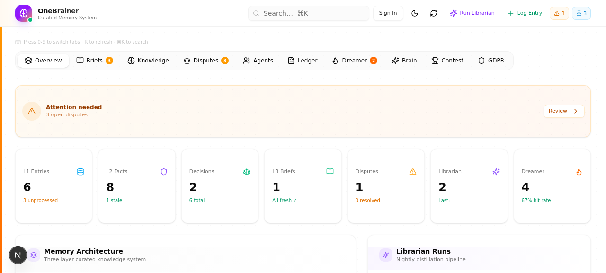
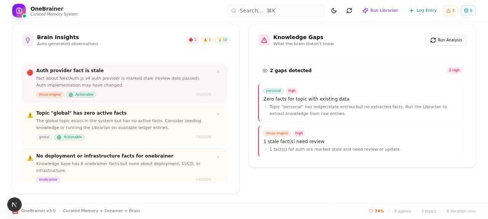

# OneBrainer

> **AI Knowledge Brain for Teams** — Multi-tenant SaaS that turns raw conversation logs into a living, queryable knowledge graph.


---

## What is OneBrainer? (ELI10)

Imagine your team has a **smart assistant with a perfect memory**. Every time your team discusses something — a decision, a technical choice, a preference — OneBrainer listens, extracts the key facts, and builds a web of connections between them.

When you later ask "Why did we choose PostgreSQL over MongoDB?", OneBrainer doesn't just search text — it **activates** the relevant knowledge nodes and spreads through the connection web, surfacing facts you forgot you even discussed. It also **dreams**: cross-pollinating ideas between unrelated topics to suggest insights your team hasn't considered.

**In short**: OneBrainer is a team memory that thinks.

---

## Screenshots

**Dashboard** — the three-layer knowledge model at a glance (L1 entries → L2 facts → L3 briefs), plus Librarian and Dreamer run state:



**Brain** — self-generated observations about the knowledge graph, and the gaps the brain knows it has:



More: [`docs/screenshots/`](docs/screenshots/)

---

## Project Status

This is an **independent R&D project**, published openly so the architecture can be read,
criticised and reused. It is feature-complete for the v5.2.0 scope described below, and
it is *not* a hosted commercial service.

One thing is worth knowing before you clone it:

- **Prompt injection is contained, not solved.** The Librarian ingests untrusted text and
  feeds it to an LLM. Every such call now fences the payload with a per-call random nonce
  and validates the reply against a strict schema before anything is written
  (`src/lib/llm-safety.ts`), so a compromised model cannot write outside the contract.
  It can still influence *which* plausible facts get extracted — see
  [SECURITY.md](./SECURITY.md).

**Running it needs one API key and nothing else.** Every model call goes through
`src/lib/llm-client.ts`, which ships three adapters: the official Anthropic SDK, any
OpenAI-compatible `/chat/completions` endpoint (OpenAI, Groq, OpenRouter, Together,
vLLM, Ollama), and the `z-ai-web-dev-sdk` this was first built against. Export
`ANTHROPIC_API_KEY` or `OPENAI_API_KEY` and the provider is auto-detected; set
`LLM_PROVIDER` and `LLM_MODEL` to pin it explicitly.

---

## Table of Contents

1. [Architecture Overview](#architecture-overview)
2. [The Three-Layer Knowledge Model](#the-three-layer-knowledge-model)
3. [Core Subsystems](#core-subsystems)
   - [Librarian — Knowledge Extraction](#librarian--knowledge-extraction)
   - [Brain — Neural Query Engine](#brain--neural-query-engine)
   - [Dreamer — Associative Insight Generator](#dreamer--associative-insight-generator)
   - [Sparks & Insights](#sparks--insights)
4. [Tech Stack](#tech-stack)
5. [Project Structure](#project-structure)
6. [Database Schema](#database-schema)
7. [API Reference](#api-reference)
8. [MCP (Model Context Protocol)](#mcp-model-context-protocol)
9. [Security Model](#security-model)
10. [Benchmark Harness](#benchmark-harness)
11. [GDPR Compliance](#gdpr-compliance)
12. [Scheduler](#scheduler)
13. [Setup & Deployment](#setup--deployment)
14. [Environment Variables](#environment-variables)
15. [Development Guide](#development-guide)
16. [Roadmap](#roadmap)

---

## Architecture Overview

```
┌─────────────────────────────────────────────────────────────┐
│                      Client (SPA)                           │
│   Next.js 16 + React 19 + Tailwind 4 + shadcn/ui           │
│   Tabs: Overview | Briefs | Knowledge | Ledger | Brain |   │
│         Dreamer | Agents | Contest | GDPR | Connectors      │
└────────────────────────┬────────────────────────────────────┘
                         │ REST API (51 routes)
┌────────────────────────▼────────────────────────────────────┐
│                   API Layer (Next.js Route Handlers)        │
│  ┌──────────┐  ┌──────────────┐  ┌────────────────────┐   │
│  │auth-     │  │withHandler() │  │CORS / Rate Limiter │   │
│  │helpers.ts│  │error wrapper │  │/ Audit Logger      │   │
│  └──────────┘  └──────────────┘  └────────────────────┘   │
└────────────────────────┬────────────────────────────────────┘
                         │
┌────────────────────────▼────────────────────────────────────┐
│                    Core Subsystems                          │
│  ┌───────────┐  ┌──────────┐  ┌──────────┐  ┌──────────┐  │
│  │ Librarian  │  │  Brain   │  │ Dreamer  │  │ Scheduler│  │
│  │ L1 → L2   │  │ Query    │  │ Sparks   │  │ (croner) │  │
│  │ extraction │  │ Engine   │  │ (bandit) │  │          │  │
│  └─────┬─────┘  └────┬─────┘  └────┬─────┘  └────┬─────┘  │
│        │              │              │              │        │
│  ┌─────▼──────────────▼──────────────▼──────────────▼─────┐ │
│  │                    Prisma ORM                          │ │
│  │              SQLite (WAL mode)                         │ │
│  └────────────────────────────────────────────────────────┘ │
└─────────────────────────────────────────────────────────────┘
                         │
              ┌──────────▼──────────┐
              │    llm-client.ts    │
              │ Anthropic / OpenAI- │
              │ compatible / z-ai   │
              └─────────────────────┘
```

**Reverse proxy**: Caddy (`:81 → localhost:3000`). Only the Next.js app is exposed externally. No wildcard port forwarding.

---

## The Three-Layer Knowledge Model

OneBrainer stores knowledge in three progressively refined layers:

### L1 — Raw Ledger (Append-Only)

The immutable source of truth. Every conversation digest, decision log, or meeting note is stored here verbatim.

```
Ledger {
  ts: string          // ISO timestamp (backdateable)
  agentId: string     // which agent produced this
  topic: string       // e.g. "backend-architecture"
  kind: string        // "digest" | "decision-log" | "meeting-notes"
  content: string     // raw text
  processed: boolean  // has the Librarian consumed this?
}
```

Ledger entries are **never deleted or modified** — they form an append-only audit trail.

### L2 — Structured Knowledge

The Librarian extracts four typed objects from L1:

| Type | Purpose | Key Fields |
|------|---------|------------|
| **Fact** | Atomic knowledge nugget | `entity`, `attribute`, `statement`, `confidence` (high/medium/low), `supersededBy` (chain) |
| **Decision** | Choices the team made | `decision`, `rationale`, `status`, `outcome`, `lesson` |
| **Preference** | How the team works | `scope` (global/topic), `statement`, `active` |
| **ProjectState** | Volatile current state | `topic`, `key`, `value`, `expiresAt` |

### L3 — Computed Derivatives

| Object | Generator | Purpose |
|--------|-----------|---------|
| **Brief** | Librarian | Delta-brief per topic: active decisions + non-stale facts + project state + preferences |
| **Association** | Librarian + Hebbian learning | `factA ↔ factB` links with strength, weight, and fire count |
| **Dispute** | Librarian | Detected contradictions between new and existing facts |
| **Spark** | Dreamer | Cross-topic associative insights (analogy, contradiction, opportunity, risk, missing-link, optimization) |
| **Insight** | Brain | Self-generated observations about the knowledge graph (gaps, orphaned facts, high-activity clusters) |
| **NeuralActivity** | Brain query | Log of every fact activation during spreading, for debugging and plasticity |

---

## Core Subsystems

### Librarian — Knowledge Extraction

**File**: `src/lib/librarian.ts` (~575 lines)

The Librarian processes unprocessed ledger entries and extracts structured knowledge.

**Pipeline**:
1. Fetch all `processed=false` ledger entries for a workspace
2. For each entry, call the configured LLM to extract: Facts, Decisions, Disputes, Preferences
3. **Auto-associate** new facts with existing facts using LLM (label: supports/contradicts/extends/related/causes/requires)
4. **Supersede chain**: if a new fact contradicts an existing one, the old fact is marked `stale` and the new one becomes the head of the chain
5. **Brief rebuild**: after all extractions, rebuild the delta-brief for affected topics
6. Mark ledger entries as `processed=true`

**Manual trigger**: `POST /api/librarian`
**Automated**: Scheduler (configurable cron, default: every 4 hours)

**Run log**: Every Librarian execution is tracked in `LibrarianRun` (startedAt, endedAt, status, counts).

### Brain — Neural Query Engine

**File**: `src/lib/brain-query.ts` (~450 lines)

The Brain implements **spreading activation** over the Fact-Association graph — a simplified model of biological neural activation.

**Query Pipeline**:
1. **Keyword extraction**: The query is tokenised on a strict character allow-list
   (`[^a-z0-9áéíóöőúüű]+`) and stop-words are dropped.
2. **Keyword seeding**: A single DB-level query finds non-stale, non-superseded facts whose
   `topic`, `entity`, `attribute` or `statement` contains at least one keyword (capped at 200 seeds).
   Seeds are scored by where the match landed — topic ×3, entity ×2, attribute ×1, plus one point
   per statement hit — then normalised to `min(score / 10, 1.0)`.
3. **Spreading activation** (iterative, default 3 iterations):
   - Neighbour activation += `source_activation × association.activationWeight × 0.3` (decay)
   - Facts and associations are **lazy-loaded** per iteration — only the activated
     neighbourhood enters memory, never the whole graph
   - After each iteration activations are renormalised so the maximum stays at 1.0
   - Facts below the threshold (default 0.05) are pruned from the result set
4. **Hebbian learning**: every association that fired gets `activationWeight += 0.02 × activationWeight`
   (capped at 1.0) and `fireCount + 1`, applied as a single batched `CASE` update.
5. **Results**: Top-N facts ranked by activation, each with `isSeed` and a human-readable
   `reason` trace explaining how it was reached.

**API**: `POST /api/brain/query`
```json
{
  "query": "Why did we choose PostgreSQL?",
  "limit": 10,
  "iterations": 3,
  "activationThreshold": 0.05
}
```

| Field | Type | Default | Notes |
|-------|------|---------|-------|
| `query` | string | — | Required |
| `limit` | int 1–50 | 10 | Max results |
| `iterations` | int 1–5 | 3 | Spreading iterations |
| `activationThreshold` | float 0–1 | 0.05 | Prune cutoff |

Rate limited to 20 requests/minute.

**Neural stats returned**:
```json
{
  "neural": {
    "totalActivated": 23,
    "seedFacts": 4,
    "spreadFacts": 19,
    "associationsFired": 47,
    "hebbianUpdates": 47,
    "iterations": 3,
    "activationThreshold": 0.05,
    "lazyLoaded": true
  }
}
```

> **Not implemented yet**: LLM-based query expansion before seeding (see [Roadmap](#roadmap)).
> Seeding today is purely lexical, which is also why fact-level embeddings are the next
> planned step.

**Other Brain endpoints**:
- `GET /api/brain/graph` — Export the full association graph for visualization
- `GET /api/brain/associations` — List associations with filters
- `GET /api/brain/neural-stats` — Aggregated neural activity statistics
- `GET /api/brain/insights` — Self-generated observations (gaps, orphans, clusters)
- `GET /api/brain/gaps` — Knowledge gap analysis
- `POST /api/brain/plasticity` — Manual Hebbian weight adjustment

### Dreamer — Associative Insight Generator

**File**: `src/lib/dreamer.ts` (~370 lines)

The Dreamer generates novel insights by **cross-pollinating** knowledge between different topics using an **ε-greedy bandit** selection strategy.

**Algorithm**:
1. **Topic pair selection** (ε-greedy, ε=0.15):
   - With probability 0.15: explore a random pair (weighted by UCB1 score)
   - With probability 0.85: exploit the pair with highest estimated value
   - Budget: 30 pair-evaluations per run
   - Topic count capped at 50 (by fact count) to avoid O(n²) explosion
2. **Cross-topic collision**: For each selected pair (topicA, topicB), collect top facts from each, call the configured LLM to generate insights
3. **Spark generation**: Each insight becomes a `Spark` with:
   - `kind`: analogy | contradiction | opportunity | risk | missing-link | optimization
   - `score`: LLM-assessed relevance (0-1)
   - Auto-associations between cross-topic facts
4. **Bandit feedback loop**: When users rate sparks (`POST /api/sparks/rate`), the SparkWeight for that topic pair is updated (hit/miss tracking)

**Manual trigger**: `POST /api/dreamer/run`
**Automated**: Scheduler (configurable cron, default: daily at 3 AM)

### Sparks & Insights

**Sparks** (from Dreamer) are actionable or thought-provoking connections between topics:
- "The caching strategy used in `payment-service` could optimize the `user-auth` token refresh pattern" (analogy)
- "Topic A says we use microservices, but Topic B shows a monolith deployment config" (contradiction)

**Insights** (from Brain) are structural observations about the knowledge graph:
- Orphaned facts (no associations)
- High-activity clusters (facts that fire frequently)
- Knowledge gaps (topics with few facts but many ledger entries)

---

## Tech Stack

| Layer | Technology | Version |
|-------|-----------|---------|
| **Framework** | Next.js (App Router) | 16.x |
| **Language** | TypeScript | 5.x |
| **Runtime** | Bun | latest |
| **UI Components** | shadcn/ui (New York style) | Radix primitives |
| **Styling** | Tailwind CSS | 4.x |
| **Icons** | Lucide React | 0.525+ |
| **Animations** | Framer Motion | 12.x |
| **Database** | SQLite (WAL mode) | via Prisma |
| **ORM** | Prisma Client | 6.x |
| **Auth** | NextAuth.js v4 | JWT sessions |
| **State (client)** | Zustand | 5.x |
| **State (server)** | TanStack Query | 5.x |
| **Validation** | Zod | 4.x |
| **Forms** | React Hook Form + @hookform/resolvers | 7.x |
| **Tables** | TanStack Table | 8.x |
| **Markdown** | @mdxeditor/editor, react-markdown | 3.x / 10.x |
| **Scheduling** | croner | 10.x |
| **LLM client** | `src/lib/llm-client.ts` | provider-agnostic |
| **LLM providers** | Anthropic SDK · OpenAI-compatible · z-ai (legacy) | — |
| **Reverse Proxy** | Caddy | — |
| **Password Hashing** | bcryptjs | 3.x |

---

## Project Structure

```
onebrainer/
├── Caddyfile                      # Reverse proxy config (:81 → :3000)
├── .env.example                   # All env vars documented
├── prisma/
│   ├── schema.prisma              # 24 models, full multi-tenant
│   └── seed.ts                    # Demo workspace + user seed
├── db/
│   └── custom.db                  # SQLite database (gitignored)
├── src/
│   ├── app/
│   │   ├── layout.tsx             # Root layout (theme, session, fonts)
│   │   ├── page.tsx               # Single-page dashboard (731 lines)
│   │   └── api/
│   │       ├── auth/              # NextAuth + register + password reset
│   │       ├── workspaces/        # CRUD
│   │       ├── ledger/            # L1 ingestion
│   │       ├── facts/             # L2 read
│   │       ├── decisions/         # L2 read + review
│   │       ├── disputes/          # List + resolve
│   │       ├── preferences/       # CRUD
│   │       ├── briefs/            # Per-topic briefs
│   │       ├── brain/             # query, graph, associations, stats, insights, gaps, plasticity
│   │       ├── librarian/         # Trigger + run log
│   │       ├── dreamer/           # Trigger
│   │       ├── sparks/            # List + rate
│   │       ├── mcp/               # Model Context Protocol endpoint
│   │       ├── agents/            # Agent key management
│   │       ├── scheduler/         # External cron tick
│   │       ├── settings/          # Workspace settings (scheduler config)
│   │       ├── stats/             # Dashboard statistics
│   │       ├── search/            # Full-text search across knowledge
│   │       ├── activity/          # Neural activity timeline
│   │       ├── user/              # Profile management
│   │       ├── gdpr/              # Privacy, consent, audit, export, erase, retention
│   │       ├── contest/           # Contests, challenges, leaderboard, achievements
│   │       ├── benchmark/         # Seed questions + run benchmark
│   │       ├── health/            # Health check
│   │       └── docs/              # API documentation endpoint
│   ├── components/
│   │   ├── ui/                    # shadcn/ui primitives (40+ components)
│   │   ├── tabs/                  # Dashboard tab components
│   │   │   ├── overview-tab.tsx
│   │   │   ├── briefs-tab.tsx
│   │   │   ├── knowledge-tab.tsx
│   │   │   ├── ledger-tab.tsx
│   │   │   ├── disputes-tab.tsx
│   │   │   ├── dreamer-tab.tsx
│   │   │   ├── agents-tab.tsx
│   │   │   ├── types.ts
│   │   │   └── helpers.ts
│   │   ├── brain/                 # Brain visualization tab
│   │   ├── gdpr-tab.tsx
│   │   ├── contest-tab.tsx
│   │   ├── connectors-tab.tsx
│   │   ├── login-dialog.tsx
│   │   ├── profile-dialog.tsx
│   │   └── workspace-switcher.tsx
│   └── lib/
│       ├── auth.ts                # NextAuth configuration (JWT, session version)
│       ├── auth-helpers.ts        # requireAuth(), getWorkspaceId(), verifyWorkspaceAccess()
│       ├── api-handler.ts         # withHandler() — error wrapping, 1MB body limit
│       ├── errors.ts              # AppError hierarchy (Auth/Forbidden/Validation/NotFound/Conflict/RateLimit)
│       ├── cors.ts                # CORS origin management
│       ├── rate-limiter.ts        # IP-based in-memory rate limiter
│       ├── audit.ts               # Fire-and-forget audit logging (10 event types)
│       ├── logger.ts              # Structured logger (LOG_LEVEL)
│       ├── password.ts            # Shared Zod password schema (Hungarian rules)
│       ├── env.ts                 # Startup env validation
│       ├── db.ts                  # Prisma client singleton
│       ├── brain-query.ts         # Spreading activation query engine
│       ├── brain-graph.ts         # Graph export for visualization
│       ├── brain-insights.ts      # Self-generated observations
│       ├── brain-stats.ts         # Neural activity statistics
│       ├── brain-gaps.ts          # Knowledge gap analysis
│       ├── librarian.ts           # L1→L2 extraction pipeline
│       ├── dreamer.ts             # ε-greedy cross-topic insight generation
│       ├── scheduler.ts           # Cron scheduler (croner)
│       ├── task-lock.ts           # Prevent concurrent librarian/dreamer runs
│       ├── benchmark.ts           # Benchmark harness (ingest→librarian→query→judge)
│       ├── benchmark-seed.ts      # 10 LongMemEval-style seed questions
│       ├── reset-tokens.ts        # Password reset token management
│       ├── pagination.ts          # Cursor/offset pagination helpers
│       ├── seed-workspace.ts      # Workspace seeding utility
│       ├── seed-contest.ts        # Contest seeding utility
│       ├── use-workspace-id.ts    # Client-side workspace ID hook
│       └── utils.ts               # cn() and misc utilities
└── public/                        # Static assets
```

---

## Database Schema

24 Prisma models organized into groups:

### Multi-Tenant Core
| Model | Purpose |
|-------|---------|
| `User` | Accounts with `sessionVersion` for session invalidation |
| `Workspace` | Tenant boundary — all data is scoped to a workspace |
| `WorkspaceMember` | User↔Workspace with RBAC role (owner/admin/member) |
| `WorkspaceSettings` | Per-workspace scheduler configuration |
| `Agent` | Machine agents with `keyHash` auth for MCP/programmatic access |

### Knowledge Layers
| Model | Layer | Purpose |
|-------|-------|---------|
| `Ledger` | L1 | Append-only raw ingestion |
| `Fact` | L2 | Typed knowledge with supersede chains and activation tracking |
| `Decision` | L2 | Team decisions with calibration loop (outcome/lesson) |
| `Preference` | L2 | Team working preferences |
| `ProjectState` | L2 | Volatile state with TTL |
| `Dispute` | L2 | Detected contradictions (workflow object, not error) |
| `Brief` | L3 | Computed delta-brief per topic (marked dirty on change) |

### Neural Graph
| Model | Purpose |
|-------|---------|
| `Association` | Fact↔Fact links with Hebbian weights, fire count, labels |
| `NeuralActivity` | Every fact activation event (for debugging/plasticity) |
| `BrainQuery` | Query log with context and usefulness feedback |
| `Spark` | Dreamer-generated cross-topic insights |
| `SparkWeight` | Bandit state per topic pair (trials/hits for ε-greedy) |
| `Insight` | Brain-generated structural observations |
| `LibrarianRun` | Extraction run log |

### Contest System
| Model | Purpose |
|-------|---------|
| `Contest` | Competition definitions |
| `ContestEntry` | Workspace participation |
| `Challenge` | Tasks within a contest |
| `Achievement` | Earned badges per workspace |

### GDPR
| Model | Purpose |
|-------|---------|
| `Consent` | User consent records (GDPR Art. 7) |
| `DataExport` | Export request tracking (GDPR Art. 20) |
| `AuditLog` | Fire-and-forget action log (10 event types) |

---

## API Reference

All 51 API routes use structured JSON responses via `withHandler()`:
```json
{
  "data": { ... },
  "error": { "code": "VALIDATION_ERROR", "message": "...", "details": {} },
  "meta": { "timestamp": "2025-01-15T10:30:00.000Z", "requestId": "m1abc2-def345" }
}
```

### Authentication
| Method | Route | Auth | Description |
|--------|-------|------|-------------|
| POST | `/api/auth/register` | Public | Register new user (email/name/password) |
| POST | `/api/auth/forgot-password` | Public | Request password reset email |
| POST | `/api/auth/reset-password` | Public | Reset password with token |
| ALL | `/api/auth/[...nextauth]` | Varies | NextAuth.js endpoints (signIn, signOut, session) |

### Workspaces
| Method | Route | Auth | RBAC | Description |
|--------|-------|------|------|-------------|
| GET | `/api/workspaces` | Required | — | List user's workspaces |
| POST | `/api/workspaces` | Required | — | Create workspace |
| GET | `/api/workspaces/[id]` | Required | Member | Get workspace details |
| PATCH | `/api/workspaces/[id]` | Required | Owner/Admin | Update workspace |
| DELETE | `/api/workspaces/[id]` | Required | Owner | Delete workspace + cascade |

### Ledger (L1)
| Method | Route | Auth | Description |
|--------|-------|------|-------------|
| POST | `/api/ledger` | Required | Ingest entries (supports backdated `ts`) |
| GET | *(via stats)* | Required | Ledger entries included in workspace stats |

### Knowledge (L2)
| Method | Route | Auth | Description |
|--------|-------|------|-------------|
| GET | `/api/facts` | Required | List facts (filter: topic, confidence, stale) |
| GET | `/api/decisions` | Required | List decisions (filter: topic, status) |
| POST | `/api/decisions/review` | Required | Calibration: add outcome/lesson to a decision |
| GET | `/api/disputes` | Required | List open/resolved disputes |
| POST | `/api/disputes/resolve` | Required | Resolve a dispute (ruling + winner) |
| GET/POST | `/api/preferences` | Required | List/create preferences |
| GET | `/api/briefs` | Required | List all topic briefs |
| GET | `/api/briefs/[topic]` | Required | Get delta-brief for a specific topic |

### Brain
| Method | Route | Auth | Description |
|--------|-------|------|-------------|
| POST | `/api/brain/query` | Required | Neural spreading activation query |
| GET | `/api/brain/graph` | Required | Export association graph (D3/vis.js compatible) |
| GET | `/api/brain/associations` | Required | List associations (filter: label, minStrength) |
| GET | `/api/brain/neural-stats` | Required | Aggregated neural activity stats |
| GET | `/api/brain/insights` | Required | Brain-generated observations |
| GET | `/api/brain/gaps` | Required | Knowledge gap analysis |
| POST | `/api/brain/plasticity` | Required | Manual Hebbian weight adjustment |

### Librarian
| Method | Route | Auth | Description |
|--------|-------|------|-------------|
| POST | `/api/librarian` | Required | Trigger L1→L2 extraction |
| GET | `/api/librarian-runs` | Required | List extraction run history |

### Dreamer
| Method | Route | Auth | Description |
|--------|-------|------|-------------|
| POST | `/api/dreamer/run` | Required | Trigger cross-topic insight generation |
| GET | `/api/sparks` | Required | List sparks (filter: kind, delivered, rating) |
| POST | `/api/sparks/rate` | Required | Rate a spark (1-5 → bandit feedback) |

### MCP (Model Context Protocol)
| Method | Route | Auth | Description |
|--------|-------|------|-------------|
| GET | `/api/mcp` | Agent keyHash | MCP discovery endpoint |
| POST | `/api/mcp` | Agent keyHash | MCP tool calls (ingest, query, brief, topics) |

### Agents
| Method | Route | Auth | RBAC | Description |
|--------|-------|------|------|-------------|
| GET | `/api/agents` | Required | — | List workspace agents |
| POST | `/api/agents` | Required | Owner/Admin | Create agent (returns API key) |
| DELETE | `/api/agents/[id]` | Required | Owner/Admin | Revoke agent key |

### Contest System
| Method | Route | Auth | Description |
|--------|-------|------|-------------|
| GET | `/api/contest/contests` | Public | List active contests |
| POST | `/api/contest/contests` | Required | Create contest (owner only) |
| GET | `/api/contest/contests/[id]` | Public | Contest details |
| PATCH | `/api/contest/contests/[id]` | Required | Update contest (owner only) |
| DELETE | `/api/contest/contests/[id]` | Required | Delete contest (owner only) |
| GET | `/api/contest/challenges` | Public | List challenges for a contest |
| POST | `/api/contest/challenges` | Required | Create challenge (contest owner) |
| POST | `/api/contest/enter` | Required | Enter workspace into contest |
| POST | `/api/contest/score` | Required | Submit score for a challenge |
| GET | `/api/contest/leaderboard` | Public | Contest leaderboard |
| GET | `/api/contest/achievements` | Required | Workspace achievements |

### GDPR
| Method | Route | Auth | Description |
|--------|-------|------|-------------|
| GET | `/api/gdpr/privacy` | Required | Privacy policy |
| GET/POST | `/api/gdpr/consent` | Required | View/record consents |
| GET | `/api/gdpr/audit` | Required | Audit log (paginated) |
| POST | `/api/gdpr/export` | Required | Request data export (GDPR Art. 20) |
| POST | `/api/gdpr/erase` | Required | Request account erasure (GDPR Art. 17) |
| GET | `/api/gdpr/retention` | Required | Data retention policy |

### System
| Method | Route | Auth | Description |
|--------|-------|------|-------------|
| GET | `/api/health` | Public | Health check |
| GET | `/api/stats` | Required | Workspace statistics (counts, topics, timeline) |
| GET | `/api/search` | Required | Full-text search across facts, decisions, ledger |
| GET | `/api/activity` | Required | Neural activity timeline |
| GET | `/api/user/profile` | Required | Current user profile |
| PATCH | `/api/user/profile` | Required | Update profile |
| GET | `/api/settings` | Required | Workspace settings (scheduler config) |
| PUT | `/api/settings` | Required | Update settings (Owner/Admin) |
| POST | `/api/scheduler/tick` | Bearer token | External cron trigger |
| GET | `/api/docs` | Public | API documentation |

### Benchmark
| Method | Route | Auth | RBAC | Description |
|--------|-------|------|------|-------------|
| GET | `/api/benchmark/seed` | Required | — | Get benchmark seed questions |
| POST | `/api/benchmark/run` | Required | Owner/Admin | Run full benchmark pipeline |

---

## MCP (Model Context Protocol)

OneBrainer exposes an **MCP endpoint** for AI agent integration (Claude Desktop, IDE plugins, custom agents).

**Authentication**: Agent keyHash — the client sends a Bearer token, the server hashes it with SHA-256 and looks it up in the `Agent` table.

```
POST /api/mcp
Authorization: Bearer <agent-api-key>
Content-Type: application/json

{
  "tool": "query",
  "args": { "context": "Why did we choose PostgreSQL?" }
}
```

**Available tools**:
- `ingest` — Add entries to the ledger
- `query` — Neural brain query
- `brief` — Get a topic's delta-brief
- `topics` — List all topics in the workspace

**CORS**: Configured separately from API CORS via `MCP_ALLOWED_ORIGINS` env var. Server-to-server SSE connections (Claude Desktop) bypass CORS.

---

## Security Model

### Authentication & Authorization
- **NextAuth.js v4** with JWT sessions (not database sessions)
- **Session invalidation**: `User.sessionVersion` is incremented on password change; JWT callback rejects stale versions
- **Multi-tenant isolation**: Every API route uses `getWorkspaceId()` → `verifyWorkspaceAccess()` — data is always scoped to the authenticated user's workspace
- **RBAC**: 5 routes enforce Owner/Admin role (workspace update/delete, agent create/delete, benchmark run)

### API Protection
- **`withHandler()` wrapper** on all 50+ routes:
  - Structured error responses (AppError hierarchy)
  - 1MB body size limit
  - Request ID generation for tracing
  - Lifecycle logging
- **Rate limiting**: IP-based in-memory (via `x-real-ip` → rightmost `x-forwarded-for`)
  - Login: 5 attempts per 15 minutes per email
  - Registration: 5 per 15 minutes per IP
  - Password reset: 3 per 15 minutes per email
  - General API: configurable per-route

### Input Validation
- **Zod schemas** on all request bodies/query params
- **Password policy** (shared schema): min 8 chars, 1 uppercase, 1 digit, 1 special char, Hungarian uppercase support
- **SQL injection**: every route goes through Prisma's parameterised query builder, with one
  deliberate exception. `src/lib/brain-query.ts` uses `$queryRawUnsafe` / `$executeRawUnsafe` in
  three places (seed keyword matching, batched Hebbian updates, batched activation updates),
  because SQLite has no efficient parameterised equivalent for a variable-length `OR ... LIKE`
  chain or a bulk `CASE` update.

  Those statements are safe today, but by construction rather than by escaping: `extractKeywords()`
  tokenises on the allow-list `[^a-z0-9áéíóöőúüű]+`, so a quote character can never reach the
  interpolation, and every other interpolated value is a number produced internally.
  **If you widen that regex, you introduce SQL injection.** A comment marks each call site.

### CORS
- **API routes**: `API_ALLOWED_ORIGINS` (comma-separated). Dev: localhost only. Prod: same-origin by default.
- **MCP endpoint**: Separate `MCP_ALLOWED_ORIGINS` for AI client origins.
- **Caddy**: Single reverse proxy to Next.js only — no wildcard port forwarding.

### Audit Logging
- **Fire-and-forget** via `src/lib/audit.ts`
- 10 event types: auth.login, auth.register, auth.logout, auth.password_change, workspace.create, workspace.update, agent.create, agent.delete, gdpr.export, gdpr.erase
- Stored in `AuditLog` table with userId, IP, user agent

### Password Reset Tokens
- Cryptographically random tokens (uuid v4)
- 1-hour expiry
- Single-use (consumed on reset)
- Tracked in `src/lib/reset-tokens.ts`

### Agent Authentication
- API keys are stored as SHA-256 hashes (`Agent.keyHash`)
- The raw key is shown only once at creation time
- Workspace isolation: agent keys are workspace-scoped

---

## Benchmark Harness

**Purpose**: Measure brain/query recall quality against known-answer questions.

**Files**: `src/lib/benchmark.ts`, `src/lib/benchmark-seed.ts`

**Pipeline**:
```
Evidence Sessions → Ledger (backdated) → Librarian (extract) → Brain Query → LLM Judge
```

**Question Types** (LongMemEval-inspired):
| Type | Tests | Description |
|------|-------|-------------|
| `single_session` | 4 | Facts from a single session are recalled |
| `multi_session` | 3 | Facts spanning multiple sessions are connected |
| `temporal` | 3 | Temporal ordering and recency are respected |

**Judge**: the configured LLM scores each result 0.0–1.0 based on whether the returned facts contain the expected answer, with partial credit.

**Cost**: depends on the configured provider and model. On a small model such as
`gpt-4o-mini` (extraction and judge alike) a 50-question run is roughly $0.50; a
local model via `OPENAI_BASE_URL` costs nothing but electricity.

**Cooldown**: 5 minutes per workspace between benchmark runs.

**Run**: `POST /api/benchmark/run` (Owner/Admin only)

---

## GDPR Compliance

OneBrainer implements core GDPR requirements:

| Article | Implementation |
|---------|---------------|
| Art. 6 (Lawful basis) | Consent records per user (`Consent` model) |
| Art. 7 (Conditions for consent) | Explicit consent tracking with granted/revoked timestamps |
| Art. 15 (Right of access) | Audit log + data export |
| Art. 17 (Right to erasure) | `/api/gdpr/erase` — cascading delete of user data |
| Art. 20 (Data portability) | `/api/gdpr/export` — generates downloadable export |
| Art. 30 (Records of processing) | `AuditLog` table with IP, user agent, timestamps |

**Data retention**: Configurable per workspace via `/api/gdpr/retention`.

---

## Scheduler

The scheduler automates recurring Librarian and Dreamer runs using [croner](https://github.com/hexagon/croner).

**Architecture**:
- In **production**: croner creates native timer-based Cron jobs
- In **development**: timers disabled (Turbopack compatibility); use manual trigger buttons in the UI
- **External tick**: `POST /api/scheduler/tick` with `SCHEDULER_SECRET` Bearer token (for cron-job.org, AWS EventBridge, etc.)
- **Task locking**: `acquireTaskLock()` / `releaseTaskLock()` prevents concurrent runs

**Default schedules**:
| Task | Cron | Description |
|------|------|-------------|
| Librarian | `0 */4 * * *` | Every 4 hours |
| Dreamer | `0 3 * * *` | Daily at 3 AM |

**Per-workspace**: Each workspace has its own enabled/disabled flags and custom cron expressions in `WorkspaceSettings`.

---

## Setup & Deployment

### Prerequisites
- **Bun** runtime (latest)
- **Node.js** 20+ (for Next.js)
- **Caddy** (for reverse proxy, optional in dev)

### Development Setup

```bash
# 1. Clone and install
git clone <repo> && cd onebrainer
bun install

# 2. Configure environment
cp .env.example .env
# Edit .env — at minimum set DATABASE_URL

# 3. Initialize database
bun run db:push
bun run db:seed

# 4. Start development server
bun run dev
# → http://localhost:3000

# 5. (Optional) Start Caddy for production-like proxy
caddy run
# → http://localhost:81
```

### Production Build

```bash
# Build
bun run build

# Run standalone server
NODE_ENV=production bun run start

# Or with Caddy
caddy run  # proxies :81 → :3000
```

### Database Migrations

```bash
bun run db:push        # Push schema changes (dev)
bun run db:migrate:dev # Create migration (dev)
bun run db:migrate:deploy # Apply migrations (prod)
```

---

## Environment Variables

See [`.env.example`](./.env.example) for the complete documented list.

| Variable | Required | Default | Description |
|----------|----------|---------|-------------|
| `DATABASE_URL` | Yes | — | SQLite connection string (`file:./db/custom.db`) |
| `LLM_PROVIDER` | No | *(auto-detect)* | `anthropic` / `openai` / `zai` |
| `LLM_MODEL` | No | per provider | Overrides the provider's default model |
| `ANTHROPIC_API_KEY` | * | — | Selects and authenticates the Anthropic adapter |
| `OPENAI_API_KEY` | * | — | Selects and authenticates the OpenAI-compatible adapter |
| `OPENAI_BASE_URL` | No | `https://api.openai.com/v1` | Point at Groq, OpenRouter, Ollama, vLLM… |
| `NEXTAUTH_SECRET` | Prod | Insecure dev fallback | JWT signing secret |
| `NEXTAUTH_URL` | Prod | `http://localhost:3000` | Public app URL |
| `SCHEDULER_SECRET` | No | *(disabled)* | Bearer token for `/api/scheduler/tick` |
| `LOG_LEVEL` | No | `info` | `debug` / `info` / `warn` / `error` |
| `API_ALLOWED_ORIGINS` | No | Dev: localhost only | Comma-separated CORS origins |
| `MCP_ALLOWED_ORIGINS` | No | Dev: localhost only | Separate CORS for MCP endpoint |
| `NEXT_PUBLIC_APP_URL` | No | — | Public URL for MCP discovery |

**Validation**: `src/lib/env.ts` validates at startup. Missing required vars = hard failure in production, warning in dev.

---

## Development Guide

### Adding a New API Route

1. Create `src/app/api/my-feature/route.ts`
2. Use `withHandler()` for error wrapping:
   ```typescript
   import { withHandler } from '@/lib/api-handler';
   import { requireAuth, getWorkspaceId } from '@/lib/auth-helpers';

   export const POST = withHandler(async (req) => {
     const userId = await requireAuth();
     const workspaceId = await getWorkspaceId(req);
     // ... your logic
     return { success: true };
   });
   ```
3. Add Zod validation for request bodies
4. Test with `bun run lint`

### Multi-Tenant Patterns

Every data-accessing route MUST:
```typescript
const userId = await requireAuth();
const workspaceId = await getWorkspaceId(req);
// All Prisma queries include: { where: { workspaceId, ... } }
```

**Development convenience**: In dev mode, `getWorkspaceId()` falls back to query param `?workspace=1` or header `x-workspace-id: 1` without auth (for curl/Postman testing). **In production, auth is always mandatory.**

### Error Handling

All errors extend `AppError`:
```typescript
throw new ValidationError("Invalid input", { field: "email" }); // 400
throw new AuthError("Not authenticated");                        // 401
throw new ForbiddenError("Insufficient permissions");            // 403
throw new NotFoundError("Workspace");                            // 404
throw new ConflictError("Email already registered");             // 409
throw new RateLimitError("Too many requests");                   // 429
```

`withHandler()` catches these and returns structured JSON responses.

### LLM Calls

Never call a provider SDK directly — go through `src/lib/llm-client.ts`. It picks the
adapter, applies the per-provider quirks (Claude rejects `temperature`; the
OpenAI-compatible adapter needs a base URL) and keeps every SDK import lazy, which is
also what avoids the Turbopack TDZ crash that module-level imports caused here.

```typescript
import { complete } from '@/lib/llm-client';
import { parseLLMJson, injectionGuard, newNonce, wrapUntrusted } from '@/lib/llm-safety';

const nonce = newNonce();
const response = await complete({
  context: 'myfeature.extract',   // shows up in logs
  effort: 'low',                  // Claude reasoning depth; ignored elsewhere
  temperature: 0.1,               // OpenAI-compatible + z-ai only
  system: `${injectionGuard(nonce)}\n\n<your instructions and output schema>`,
  user: wrapUntrusted(userSuppliedText, nonce),
});

// Never JSON.parse() a model reply directly — validate against a Zod schema.
const result = parseLLMJson(response.text, MySchema, 'myfeature.extract');
if (!result) return fallback();   // malformed or hostile reply — degrade, don't throw
```

Two rules that are not optional: **fence anything user-supplied** with
`wrapUntrusted()` + `injectionGuard()`, and **validate every reply** with
`parseLLMJson()` before it touches the database. See [SECURITY.md](./SECURITY.md).

**Adding a provider**: implement one `complete*()` function in `llm-client.ts`, add it
to the `LLMProvider` union and the `switch`, and give it a default model. Nothing
outside that file needs to change.

### UI Development

- Use **shadcn/ui** components from `src/components/ui/`
- Dashboard is a **single-page app** in `src/app/page.tsx` with tab navigation
- Client state: `useWorkspaceId()` hook for workspace context
- Styling: Tailwind CSS 4 with `cn()` utility
- Light/dark mode: `next-themes`
- Animations: Framer Motion

---

## Roadmap

### Current Status (v5.2.0)
- [x] Three-layer knowledge model (Ledger → Facts/Decisions → Briefs)
- [x] Neural spreading activation query engine (lazy-loaded, batched Hebbian updates)
- [x] ε-greedy Dreamer with bandit feedback loop
- [x] MCP endpoint with agent keyHash auth
- [x] Multi-tenant RBAC (owner/admin/member)
- [x] GDPR compliance (consent, export, erase, audit)
- [x] Prompt-injection containment on every LLM call (nonce fencing + schema validation)
- [x] Provider-agnostic LLM client (Anthropic · OpenAI-compatible · z-ai)
- [x] Role-gated MCP pipeline tools (`run_dreamer`, `run_librarian`)
- [x] Benchmark harness (LongMemEval-style)
- [x] Contest system
- [x] Full security audit (17 findings fixed)

### Planned
- [ ] **Phase A**: LLM query expansion before keyword seeding (designed, not yet built)
- [ ] **Structured outputs** on the Anthropic adapter (`output_config.format`) instead of
      parsing JSON out of free text — the uniform text contract is what keeps the
      adapters interchangeable today
- [ ] Broaden test coverage to the extraction and query pipelines (needs a test database)
- [ ] **Phase C**: Fact-level embeddings for hybrid seed (semantic + keyword)
- [ ] Real-time WebSocket notifications
- [ ] File/document ingestion (PDF, DOCX, Markdown)
- [ ] Multi-language support (i18n)
- [ ] Team collaboration features (comments, @mentions)
- [ ] Mobile-responsive dashboard improvements
- [ ] Usage analytics and billing (Stripe integration)

---

## License

[MIT](./LICENSE) © 2026 Molnár Barna.

---

## Author

Built by **Molnár Barna** ([@deltafly](https://github.com/deltafly)).

OneBrainer is an independent R&D project, built to answer a question that keeps coming
up in practice: *if an AI agent has no memory between sessions, how much of a team's
reasoning quietly evaporates?*

The design bet is that **memory quality is decided at write time, not at read time** —
a curated L2 layer written by a single authority (the Librarian) beats a large pile of
embeddings searched at query time. Everything else in this repo follows from that bet.

Feedback, criticism and issues are welcome.